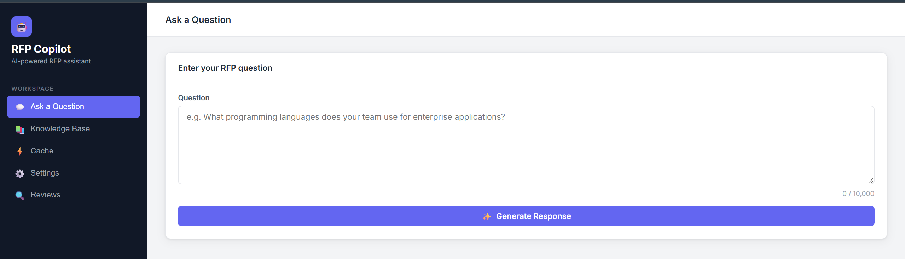
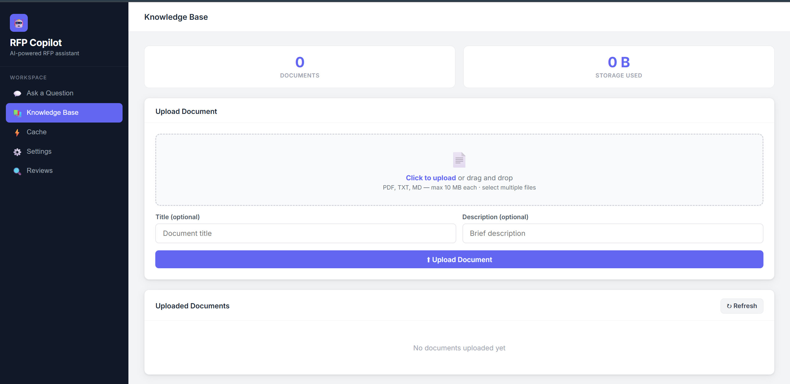
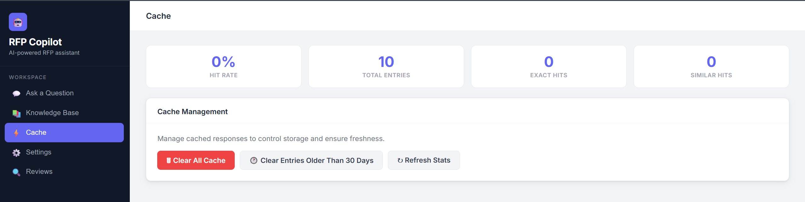
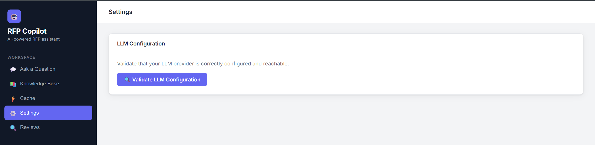

## This is a private project built specifically for assisting pre-sales and solutioning  teams to craft curated and contextualized response to the RFI/RFP/RFQ, For more details contact through Linkedin - [Debasis Mohanty](https://www.linkedin.com/in/debasis07/ )

# RFP Copilot Web App

An AI-augmented enterprise web application that assists proposal teams in generating structured, context-aware RFP responses using a **multi-agent AI pipeline**, intelligent caching, organizational memory, and a human-in-the-loop review workflow.

---





---
## Project Summary

RFP Copilot transforms how organizations respond to Requests for Proposal. Instead of a single LLM call, it orchestrates four specialized AI agents — **Planner, Researcher, Writer, and Critic** — each with a dedicated role and system prompt. The Researcher agent searches both your company knowledge base and a growing organizational memory of past approved responses, so the system gets smarter with every approval. Every response goes through a quality gate (Critic scores 1–10) and a human review workflow before being finalized, with approved responses automatically written back to cache and memory for future reuse.

### Key Highlights

## Tech Stack & Dependencies

### Runtime & Language

| Layer | Technology |
|-------|-----------|
| **Runtime** | Node.js 16.x or higher |
| **Language** | JavaScript (CommonJS — `require`/`module.exports` throughout) |
| **Module system** | CommonJS (no ESM/TypeScript compilation required) |
| **Frontend** | Vanilla HTML5 + CSS3 + JavaScript (no framework) |
| **Storage** | File system (JSON files — no external database) |

### Production Dependencies

| Package | Version | Role in this project |
|---------|---------|----------------------|
| `express` | ^4.18.2 | Web server framework — handles all REST API routing, middleware, static file serving, and JSON parsing |
| `dotenv` | ^16.3.1 | Loads environment variables from `.env` into `process.env` at startup — used for API keys, provider selection, cache config, and server settings |
| `cors` | ^2.8.5 | Cross-Origin Resource Sharing middleware — restricts browser access to the API to origins listed in `CORS_ORIGINS` |
| `openai` | ^4.104.0 | Official OpenAI Node.js client — used for chat completions (`callWithTools`) enabling the multi-agent pipeline (Planner, Researcher, Writer, Critic) with function/tool calling; also provides `embed()` via `text-embedding-3-small` for semantic memory search in `AgentMemory` |
| `@aws-sdk/client-bedrock-runtime` | ^3.450.0 | AWS SDK v3 client for Bedrock — invokes Nova Pro and Claude models via `InvokeModelCommand` for the classic RAG pipeline when Bedrock is the selected provider; model-aware request builder handles both Nova Pro (Messages API) and Claude 3.x formats |
| `@aws-sdk/client-bedrock-agent-runtime` | ^3.1014.0 | AWS SDK v3 client for Bedrock Agent Runtime — used for semantic vector search via `RetrieveCommand` against Bedrock Knowledge Base, and content filtering via Guardrails on KB retrieval results |
| `multer` | ^2.1.1 | Multipart form-data middleware for Express — handles document file uploads (PDF, TXT, MD) to the knowledge base endpoint; configured with memory storage and 10MB size limit |
| `pdf-parse` | ^1.1.1 | Extracts plain text from PDF file buffers — used by `TextExtractor` to chunk PDF documents for knowledge base indexing |

### Development Dependencies

| Package | Version | Role in this project |
|---------|---------|----------------------|
| `jest` | ^29.7.0 | Test runner — executes all unit, integration, and property-based tests; configured via `jest.config.js` |
| `fast-check` | ^3.15.0 | Property-based testing library — generates 100+ random inputs per test to verify correctness properties of CacheManager, SimilarityCalculator, KnowledgeBase, ResponseGenerator, and other components |
| `supertest` | ^6.3.3 | HTTP assertion library for Express — used in server and integration tests to make in-process HTTP requests without starting a real server |

### Node.js Built-in Modules Used

| Module | Usage |
|--------|-------|
| `fs` | Synchronous file I/O for all JSON persistence (cache, knowledge base, memory, reviews) |
| `path` | Cross-platform file path construction |
| `crypto` | SHA-256 hashing for exact cache key generation |

### Frontend Stack

| Technology | Usage |
|-----------|-------|
| **HTML5** | Single-page layout (`public/index.html`) with 5 panel sections |
| **CSS3** | Custom properties (CSS variables), flexbox layout, responsive sidebar |
| **Vanilla JavaScript** | All UI logic in `public/app.js` — fetch API, DOM manipulation, event handling |
| **No framework** | Zero dependencies on React, Vue, Angular, or any bundler |

---

## Features

- **Multi-Agent Orchestration**: Four specialized agents coordinate response generation — Planner decides strategy, Researcher searches KB and organizational memory, Writer drafts the response, Critic scores and revises
- **Organizational Memory**: Approved responses accumulate as institutional knowledge in `data/memory/` — the Researcher agent references past RFP wins for future similar questions
- **Semantic Memory Search**: `AgentMemory` uses OpenAI `text-embedding-3-small` (1536-dim vectors) for cosine similarity search; automatically falls back to keyword overlap when embeddings are unavailable or the API is unreachable
- **Agent Reasoning Trace**: Collapsible UI panel shows every agent action, tool call, and critique score for full transparency
- **Intelligent Response Caching**: Exact and Jaccard similarity-based caching reduces API costs by 60–80%; approved responses also written to cache
- **Human Review Workflow**: Per-category review tasks routed to designated reviewers; approve/reject with timestamps and optional comments; approved responses written to cache and memory
- **Knowledge Base Integration**: Two modes — Amazon Bedrock KB (semantic vector search via Titan Embeddings v2) when `BEDROCK_KB_ID` is set, or local keyword-based retrieval as fallback; Researcher only uses KB when relevant (relevance score ≥ 2)
- **Bedrock Guardrails**: Content filtering on KB retrieval — blocks harmful content, detects PII, validates topic relevance before injecting context into prompts
- **Source Citations**: Responses include hyperlinked document badges showing which KB files were referenced
- **Multi-file Upload**: Upload multiple documents at once with sequential progress tracking
- **Multiple LLM Provider Support**: OpenAI (gpt-4o-mini, multi-agent) or AWS Bedrock (Claude, classic RAG)
- **Web Interface**: Dark sidebar UI with Ask, Knowledge Base, Cache, Settings, and Reviews panels
- **Export Functionality**: Export responses in JSON or plain text format
- **Robust Error Handling**: Automatic retry with exponential backoff (3 attempts: 1s → 2s → 4s)
- **Configuration Validation**: Test LLM provider connectivity before processing questions

---

## Prerequisites

- Node.js 16.x or higher
- npm or yarn package manager
- API credentials for either:
  - OpenAI API key (recommended — enables full multi-agent mode), or
  - AWS account with Bedrock access (uses classic RAG pipeline)

## Architecture

### System Components

```
┌─────────────────────────────────────────────────────────┐
│   Browser (Vanilla JS + HTML)                           │
│   Ask / KB / Cache / Settings / Reviews panels          │
│   Agent Reasoning Trace (collapsible)                   │
└──────────────────────────┬──────────────────────────────┘
                           │ HTTP REST
                           ▼
┌─────────────────────────────────────────────────────────┐
│              Express API Server (port 3000)             │
│                                                         │
│  ┌───────────────────────────────────────────────────┐  │
│  │  Cache Manager                                    │  │
│  │  - Exact match (SHA-256 hash)                     │  │
│  │  - Similarity match (Jaccard ≥ 0.85)              │  │
│  └───────────────────────────────────────────────────┘  │
│  ┌───────────────────────────────────────────────────┐  │
│  │  Multi-Agent Orchestrator (OpenAI)                │  │
│  │  1. Planner  — strategy + classification          │  │
│  │  2. Researcher — KB search + memory search        │  │
│  │  3. Writer   — draft response                     │  │
│  │  4. Critic   — score + revise (threshold: 7/10)   │  │
│  └───────────────────────────────────────────────────┘  │
│  ┌───────────────────────────────────────────────────┐  │
│  │  Knowledge Base                                   │  │
│  │  - Bedrock KB: semantic vector search (Titan v2)  │  │
│  │  - Guardrail: content filtering on retrieval      │  │
│  │  - Local fallback: keyword Jaccard (score ≥ 2)    │  │
│  └───────────────────────────────────────────────────┘  │
│  ┌───────────────────────────────────────────────────┐  │
│  │  Agent Memory                                     │  │
│  │  - Semantic search (cosine, text-embedding-3-small│  │
│  │  - Keyword fallback (Jaccard) when no embeddings  │  │
│  │  - Stores vectors in data/memory/embeddings.json  │  │
│  └───────────────────────────────────────────────────┘  │
│  ┌───────────────────────────────────────────────────┐  │
│  │  Review Manager                                   │  │
│  │  - Per-category routing to reviewers              │  │
│  │  - Timestamped approve/reject + comments          │  │
│  │  - Post-approval: writes to cache + memory        │  │
│  └───────────────────────────────────────────────────┘  │
│  ┌───────────────────────────────────────────────────┐  │
│  │  LLM Provider Adapter                             │  │
│  │  - callWithTools() — multi-agent (OpenAI)         │  │
│  │  - callLLM()       — classic RAG (Bedrock)        │  │
│  └───────────────────────────────────────────────────┘  │
└────────────────────┬────────────────────────────────────┘
                     │
              ┌──────┴──────┐
              ▼             ▼
        ┌──────────┐  ┌──────────────┐
        │  OpenAI  │  │   Bedrock    │
        │gpt-4o-mini│  │  Nova Pro    │
        └──────────┘  │  + KB + Guard│
                      └──────────────┘

┌─────────────────────────────────────────────────────────┐
│     File System Storage                                 │
│  data/cache/      — entries.json, stats.json            │
│  data/knowledge/  — documents.json, chunks.json         │
│  data/memory/     — approved_responses.json             │
│  data/reviews/    — tasks.json                          │
└─────────────────────────────────────────────────────────┘
```

### Request Flow

```
User Question
      ↓
Cache lookup (exact SHA-256) ──→ HIT: return instantly (< 50ms), reviewStatus: approved
      ↓ miss
Cache lookup (Jaccard ≥ 0.85) ─→ HIT: return cached response, reviewStatus: approved
      ↓ miss
Multi-Agent Pipeline (OpenAI):
  Planner  → classify + strategy + needsKB/needsMemory flags
  Researcher → search_knowledge_base + search_memory (tool-calling loop, max 4 iter)
  Writer   → draft response using plan + research brief
  Critic   → score 1-10; revise if score < 7
      ↓
Store in cache + create review tasks (per category, routed to reviewer)
      ↓
Return to UI (responseText + agentTrace + critiqueScore + plan + memoryHitsUsed)
      ↓
On Review Approval:
  → Write to cache (future similar questions get instant hit)
  → Write to organizational memory (agents reference for future questions)
  → Record reviewedAt timestamp + reviewer comment
```

**Test suite: 564 tests** including 28 property-based tests (100+ iterations each via fast-check)

| Category | Files |
|----------|-------|
| Cache Manager | `cache-manager.test.js`, `cache-manager.property.test.js` |
| Knowledge Base | `knowledge-base.test.js`, `knowledge-base.property.test.js` |
| Storage Backend | `storage-backend.test.js`, `storage-backend.property.test.js` |
| Text Extractor | `text-extractor.test.js`, `text-extractor.property.test.js` |
| Similarity Calculator | `similarity.test.js`, `similarity.property.test.js` |
| Response Generator | `response-generator.test.js`, `response-generator.property.test.js` |
| Question Classifier | `classifier.test.js`, `classifier.property.test.js` |
| Server / API | `server.test.js`, `server.property.test.js` |
| Integration | `cache-flow-integration.test.js`, `kb-flow-integration.test.js`, `response-generator-kb-integration.test.js`, `cache-config-integration.test.js` |

---

## Performance

| Scenario | Response Time |
|----------|--------------|
| Exact cache hit | < 50ms |
| Similar cache hit | < 50ms |
| Multi-agent (no KB/memory) | 8–12 seconds |
| Multi-agent (with KB + memory) | 12–20 seconds |
| Bedrock classic RAG | 3–8 seconds |

- Cache reduces LLM API calls by **60–80%** for repeated questions
- Each multi-agent response = 4 LLM calls (one per agent)
- Stateless design supports horizontal scaling

## Security Considerations

- API keys stored in `.env` (excluded from git via `.gitignore`)
- Credentials never exposed in HTTP responses or logs
- CORS restricted to `CORS_ORIGINS` — tighten for production
- Input validation: 1–10,000 character limit, 1MB JSON body limit
- Rate limiting: 10 questions/minute per user
- Use HTTPS in production via reverse proxy (nginx/Apache)
- Review audit trail: every approval/rejection timestamped with reviewer comment

## Future Enhancements

- LangGraph agent workflow (stateful multi-step graph with self-correction loops)
- Vector embeddings for KB (replace Jaccard with semantic similarity — memory already uses this)
- Confidence-gated escalation — auto-escalate to senior reviewer if confidence < threshold
- Streaming responses — token-level streaming to UI for real-time rendering
- Auto RFP document ingestion (watch folder / S3 trigger)
- Proposal generation (DOCX export)
- Multi-turn conversation (session-level memory across questions)
- Multi-user collaboration with role-based access
- AWS deployment (ElastiCache + OpenSearch + S3 + Bedrock)
